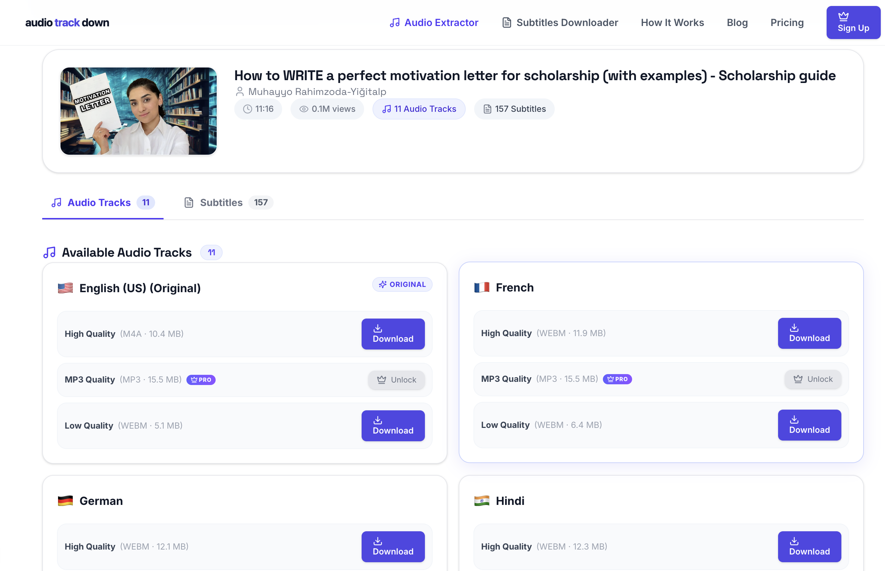

# AudioTrackDown 🎵

<p align="center">
  
</p>

<p align="center">
  <strong>Fast, high-performance web application to extract original audio, multi-language dubbed voice tracks, and subtitles (157+ languages) from YouTube and Facebook videos — 100% Ad-Free.</strong>
</p>

<p align="center">
  
  
  
  
  
  
  
</p>

---

## ✨ Features

- **Multi-Track Audio Extraction**: Extract and download original and dubbed multi-language audio streams from YouTube and Facebook.
- **Multiple Formats**: Download in High Quality **M4A**, Compact **WebM**, or **MP3**.
- **157+ Subtitle Languages**: Export auto-generated captions or official creator subtitles in **SRT**, **VTT**, or **JSON** format.
- **100% Ad-Free Experience**: Direct, instant downloads with zero ads, countdowns, or popups.
- **Live Search & Filter**: Real-time filtering across all available subtitle tracks.
- **Audio / Subtitle Tab Switcher**: Easily toggle between audio tracks and subtitle lists with exact count badges.
- **Clean & Compact UI**: Mobile-friendly, modern glassmorphic interface with low vertical height.

---

## 📋 What to Install (Prerequisites)

Before running AudioTrackDown locally, ensure you have the following installed on your system:

| Tool | Recommended Version | Purpose |
| :--- | :--- | :--- |
| **Node.js** | `v18.x` or `v20.x+` | JavaScript runtime for both frontend and backend |
| **pnpm** | `v9.x+` | Fast package manager for frontend dependencies |
| **Python** | `3.10+` | Required by `yt-dlp` |
| **FFmpeg** | `v5.x+` or `v6.x+` | Audio transcoding (MP3 conversion) |
| **yt-dlp** | Latest | Core video & audio stream extractor |

### Install Prerequisites on Your OS

#### 🍏 macOS (using Homebrew)
```bash
brew install node pnpm python ffmpeg yt-dlp
```

#### 🐧 Ubuntu / Debian
```bash
sudo apt update
sudo apt install -y nodejs npm python3 python3-pip ffmpeg
sudo npm install -g pnpm

# Install latest yt-dlp binary
sudo wget https://github.com/yt-dlp/yt-dlp/releases/latest/download/yt-dlp -O /usr/local/bin/yt-dlp
sudo chmod a+rx /usr/local/bin/yt-dlp
```

#### 🪟 Windows (using winget)
```powershell
winget install OpenJS.NodeJS.LTS
winget install pnpm.pnpm
winget install Python.Python.3.11
winget install Gyan.FFmpeg
winget install yt-dlp.yt-dlp
```

---

## 🚀 How to Run Locally

AudioTrackDown is structured as a monorepo with `backend/` and `frontend/`.

### 1. Clone the Repository
```bash
git clone https://github.com/abubokkor-cse/audiotrackdown.git
cd audiotrackdown
```

---

### 2. Start the Backend Server

The backend runs an Express server that executes `yt-dlp` and `ffmpeg` for audio stream extraction and conversion.

```bash
# 1. Navigate to the backend directory
cd backend

# 2. Install dependencies
npm install

# 3. Create your local .env configuration
cp .env.example .env

# 4. Start the backend development server
npm run dev
```

> Backend will start on: **`http://localhost:4001`**

---

### 3. Start the Frontend Application

The frontend is a Next.js 15 application.

```bash
# 1. In a new terminal window, navigate to the frontend directory
cd frontend

# 2. Install dependencies
pnpm install

# 3. Create your local .env configuration
cp .env.example .env.local

# 4. Start the frontend development server
pnpm dev
```

> Frontend will start on: **`http://localhost:3000`**

Open **`http://localhost:3000`** in your browser to extract audio tracks and download subtitles!

---

## ⚙️ Local Environment Configuration

### Backend (`backend/.env`)

```env
PORT=4001
NODE_ENV=development
FRONTEND_URL=http://localhost:3000
BACKEND_SECRET=shared-secret
RATE_LIMIT_WINDOW_MS=900000
RATE_LIMIT_MAX_REQUESTS=50
YTDLP_TIMEOUT_MS=30000
```

### Frontend (`frontend/.env.local`)

```env
BASE_URL=http://localhost:3000
BACKEND_URL=http://localhost:4001
NEXT_PUBLIC_API_URL=http://localhost:4001
BACKEND_SECRET=shared-secret
```

---

## 📂 Project Structure

```
audiotrackdown/
├── audiotrackdown.png         # Preview screenshot
├── backend/                  # Node.js + Express backend
│   ├── src/
│   │   ├── controllers/      # Extract, download, and subtitle handlers
│   │   ├── middleware/       # Security headers, rate limiting
│   │   ├── services/         # yt-dlp runner and stream proxy
│   │   └── server.js         # Express app initialization
│   ├── package.json
│   └── .env.example
└── frontend/                 # Next.js 15 + React 19 + Tailwind CSS
    ├── app/
    │   ├── (dashboard)/
    │   │   ├── page.tsx      # Main audio extraction & subtitle tool
    │   │   └── youtube-subtitle-downloader/ # Subtitle tool page
    │   ├── api/              # API proxy routes to backend
    │   └── layout.tsx        # Root layout & styling
    ├── components/           # UI components & badges
    ├── package.json
    └── pnpm-lock.yaml
```

---

## 📄 License

MIT © [Md. Abu Bokkor](https://github.com/abubokkor-cse)
